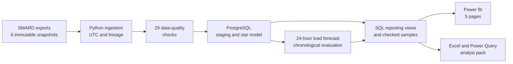
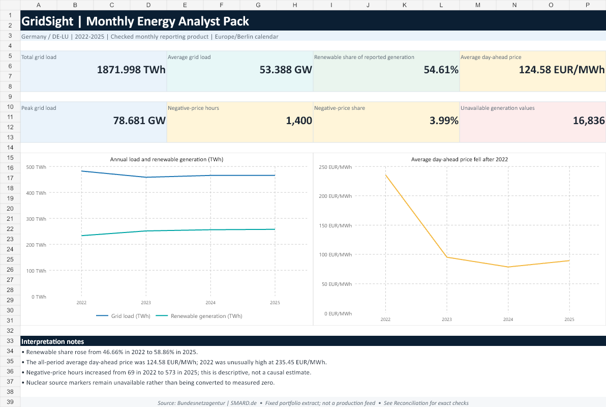

# GridSight

[](https://github.com/BpouyaJ/Gridsight/actions/workflows/portfolio-ci.yml)

**End-to-end energy analytics, business intelligence, and day-ahead load
forecasting for Germany and the DE/LU electricity market.**

GridSight turns six immutable Bundesnetzagentur SMARD exports into a tested
UTC-normalized analytical model, PostgreSQL reporting layer, leakage-safe
24-hour load forecast, five-page Power BI report, and refreshable Excel analyst
pack. It covers the complete 2022-2025 Europe/Berlin calendar period while
keeping MW, MWh, TWh, EUR/MWh, counts, and percentages explicit.


## Portfolio results

| Evidence | Verified result |
|---|---:|
| Canonical hourly coverage | 35,064 UTC hours |
| Total grid load | 1,871.998 TWh |
| Renewable share of reported generation | 54.61% |
| Negative DE/LU price exposure | 1,400 hours / 3.99% |
| Frozen 2025 model MAE | 1,398.259 MW |
| Frozen 2025 model MAPE | 2.652% |
| MAE improvement over weekly naive | 46.541% |
| Published data-quality checks | 29 / 29 passed |
| Public-clone automated tests | 92 passed |
| Local generated-artifact tests | 7 passed |
| Live PostgreSQL integration tests | 6 passed |

The selected histogram-gradient-boosting model was chosen on 2024 validation
data, refit on 2022-2024, and evaluated once on the untouched 2025 test year.
Its final result is historical evidence, not a production-service claim.

## What this project demonstrates

- **Data engineering:** immutable source registration, SHA-256 lineage,
  locale-aware parsing, DST-safe UTC normalization, and atomic publication.
- **Analytics engineering:** constrained PostgreSQL staging, conformed
  dimensions, separate fact grains, six stable reporting views, and explicit
  reconciliation checks.
- **Forecasting:** information-cutoff contracts, 24- and 168-hour seasonal
  baselines, 27 leakage-safe features, chronological validation, frozen model
  selection, and horizon-level evaluation.
- **Business intelligence:** 15-table Power BI star model, 12 one-way
  relationships, 30 explicit DAX measures, five pages, and 21 visuals.
- **Excel analytics:** formula-backed dashboard, reconciliation sheet, native
  Power Query connection, query-backed table, and native PivotTable.
- **Software quality:** 92 public-clone tests, seven local generated-artifact
  tests, six opt-in database tests, Ruff, fail-fast logging, deterministic
  checked artifacts, and GitHub Actions.

## Architecture



UTC is the unique event-time key. Europe/Berlin fields are retained for local
calendar reporting, including both autumn DST folds and 23/25-hour days. See
the [full architecture and data model](docs/architecture.md).

## Forecast design

| Stage | Contract |
|---|---|
| Forecast issue time | Europe/Berlin local midnight |
| Horizon | Next 24 real hourly observations |
| Train | 2022-2023 |
| Validation and model selection | 2024 |
| Final test | 2025, evaluated once |
| Baselines | Previous day and previous week |
| Candidates | Ridge and histogram gradient boosting |
| Selected design | `hist_gradient_boosting_31_leaves` |
| Features | Target-calendar, lag, and rolling signals available at origin |

The test year did not influence feature design, preprocessing, hyperparameter
selection, or candidate selection. Detailed assumptions and horizon results
are in the [forecasting protocol](docs/forecasting-protocol.md) and
[final evaluation](docs/final-forecast-evaluation.md).

## Power BI report

Open [`powerbi/GridSight.pbip`](powerbi/GridSight.pbip) in Power BI Desktop.
The source-controlled PBIP/PBIR/TMDL project uses compact checked extracts, so
reviewers do not need the private raw snapshots or PostgreSQL database.

The report answers four business questions: portfolio scale, load and renewable
patterns, price behavior, and final forecast performance. A fifth page exposes
all quality checks and source lineage. See the
[report walkthrough and interpretation limits](docs/power-bi-report.md).

## Excel analyst pack

Open
[`excel/GridSight_Monthly_Energy_Analyst_Pack.xlsx`](excel/GridSight_Monthly_Energy_Analyst_Pack.xlsx)
for the business-user companion to Power BI.



The workbook opens with cached results, reconciles nine metrics with the SQL
and Power BI contracts, and includes the native `MonthlyEnergy` Power Query and
year-by-month PivotTable. Update the repository-root parameter on **Setup** and
use **Data > Refresh All** to refresh it locally. See the
[Excel guide](excel/README.md).

## Verify a public clone

GridSight requires Python 3.13. From the repository root:

```powershell
py -3.13 -m venv .venv
& '.\.venv\Scripts\python.exe' -m pip install -e ".[dev,analysis]"
& '.\.venv\Scripts\python.exe' -m gridsight.verify_portfolio
```

The last command validates the checked Power BI artifacts, runs Ruff, executes
all 92 public-clone tests, stops on the first failure, and writes
`logs/portfolio-check.log`. It does not require raw or generated processed data,
Power BI Desktop, Excel, Docker, or PostgreSQL.

When the ignored generated files under `data/processed/` exist locally, add the
seven artifact-backed checks:

```powershell
& '.\.venv\Scripts\python.exe' -m gridsight.verify_portfolio --with-local-artifacts
```

For the six live database tests, start the configured service and run:

```powershell
docker compose up -d postgres
& '.\.venv\Scripts\python.exe' -m gridsight.verify_portfolio --with-postgres
```

See [development setup](docs/development-setup.md),
[database setup](docs/database-setup.md), and
[automation/CI](docs/automation-and-ci.md) for the complete local workflow.

## Repository map

| Path | Purpose |
|---|---|
| [`src/gridsight/`](src/gridsight/) | Reusable ingestion, validation, database, reporting, and forecasting code |
| [`sql/`](sql/) | Ordered schemas, tables, transformations, analysis queries, and reporting views |
| [`tests/`](tests/) | Fast contracts and opt-in PostgreSQL integration coverage |
| [`data/samples/`](data/samples/) | Eight compact, deterministic, attributed public extracts |
| [`reports/`](reports/) | Checked KPI, EDA, forecasting, BI contracts, and figures |
| [`notebooks/`](notebooks/) | Thin source-profiling and exploratory-analysis presentations |
| [`powerbi/`](powerbi/) | Power BI project, DAX catalogue, and semantic contract |
| [`excel/`](excel/) | Refreshable analyst workbook and versioned Power Query M code |
| [`docs/`](docs/) | Architecture, methods, decisions, quality rules, and limitations |

## Key analytical findings

- Renewable generation's share of reported generation increased from 46.66%
  in 2022 to 58.86% in 2025.
- The average DE/LU day-ahead price fell from 235.45 EUR/MWh in 2022 to
  89.32 EUR/MWh in 2025, while negative-price hours increased from 69 to 573.
- Wind onshore was the largest individual generation technology in the
  four-year checked result, contributing 439.321 TWh.
- The learned model beat both seasonal-naive baselines on the untouched 2025
  test, but accuracy varied by forecast horizon.

These are descriptive associations from one historical market period. They do
not establish causality or future operational performance.

## Scope and limitations

- The repository publishes checked samples and aggregate evidence; full raw and
  processed row-level datasets remain local and hash-referenced.
- The forecast uses load history and known calendar features only. Weather,
  outages, price forecasts, and operational schedules are intentionally absent.
- The model is a reproducible offline experiment, not a deployed or monitored
  production forecast.
- Power BI and Excel consume static checked extracts by default; their refresh
  paths are local portfolio workflows, not hosted services.
- The selected 2022-2025 geography and market regime limit generalization.

## Documentation

- [Architecture and analytical data model](docs/architecture.md)
- [Source contract and attribution](docs/source-contract.md)
- [Data-quality validation](docs/data-quality.md)
- [PostgreSQL analytical model](docs/database-model.md)
- [SQL reporting views](docs/reporting-views.md)
- [Exploratory analysis](docs/exploratory-analysis.md)
- [Final forecast evaluation](docs/final-forecast-evaluation.md)
- [Power BI report](docs/power-bi-report.md)
- [Excel analyst pack](excel/README.md)
- [Automation and continuous integration](docs/automation-and-ci.md)
- [Final portfolio audit](docs/portfolio-audit.md)
- [Decision log](docs/decisions.md)

## Data attribution and license

Market data and committed samples are attributed to **Bundesnetzagentur |
SMARD.de** and governed by the source's CC BY 4.0 terms. The project code and
original documentation are available under the [MIT License](LICENSE).

Maintained by **Mohammad Pouya Borji** as an independently built portfolio
project for energy analytics, BI, data, and forecasting roles.
