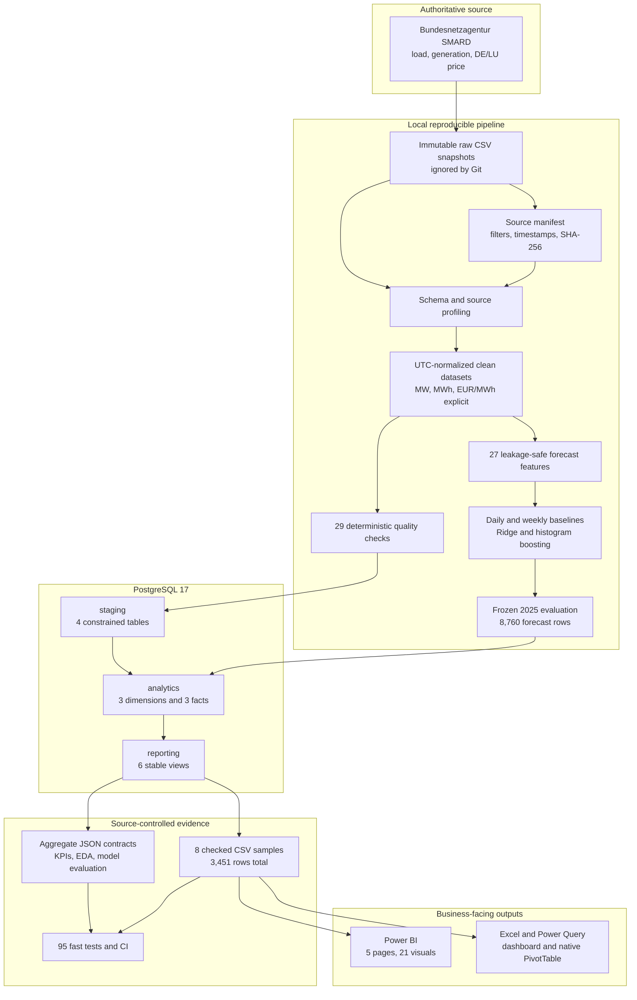
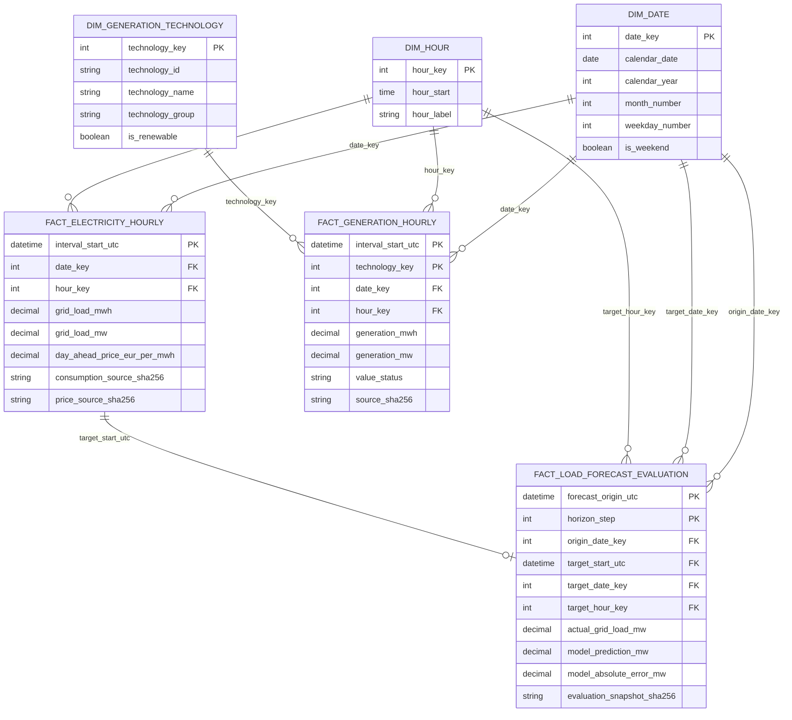

# Architecture and analytical data model

## System flow

GridSight separates immutable inputs, generated local data, database products,
checked public evidence, and presentation tools. That boundary lets a reviewer
verify the project from a clean clone without publishing the complete raw or
row-level forecast datasets.

## Analytical star model

The two energy facts stay separate because they have different grains. The
forecast fact links each final-test target to the corresponding actual hourly
fact and to conformed calendar dimensions.

## Time, unit, and availability rules

| Concern | Enforced rule |
|---|---|
| Fact identity | UTC timestamps are unique; Europe/Berlin fields are reporting attributes. |
| Daylight saving time | Spring gaps and both autumn folds are preserved without duplicate UTC keys. |
| Energy | MWh/TWh are summed only across compatible intervals. |
| Power | MW/GW are averaged or compared at the declared grain, never summed as energy. |
| Price | EUR/MWh is averaged with explicit observed-hour weighting; negative values remain valid. |
| Generation gaps | Source `-` markers become unavailable/null, never measured zero. |
| Forecast availability | Every feature must be complete by its forecast origin. |
| Lineage | Source export IDs and SHA-256 values survive into canonical and analytical products. |

## Reporting boundary

Power BI and Excel read stable reporting products rather than staging tables.
The public PBIP and workbook use deterministic samples so they open with useful
results on another machine. A database-backed rebuild remains available for
the full local pipeline, while source-controlled contracts prevent the desktop
tools from redefining metric semantics.
