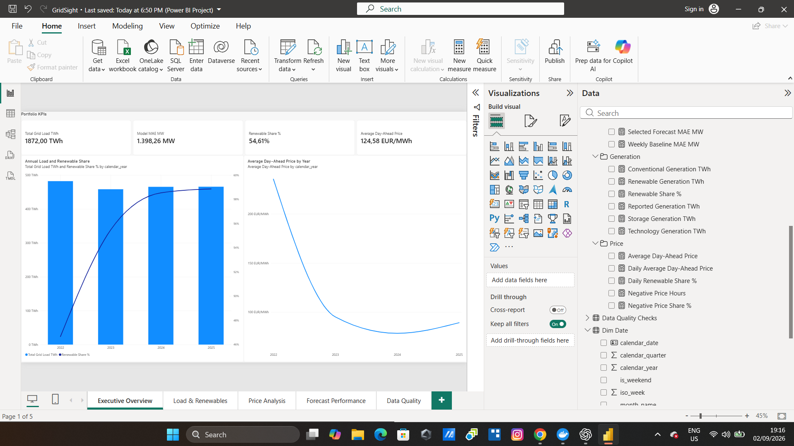
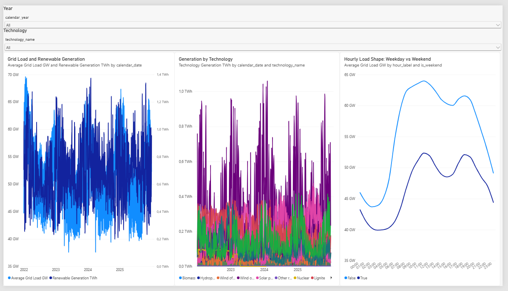
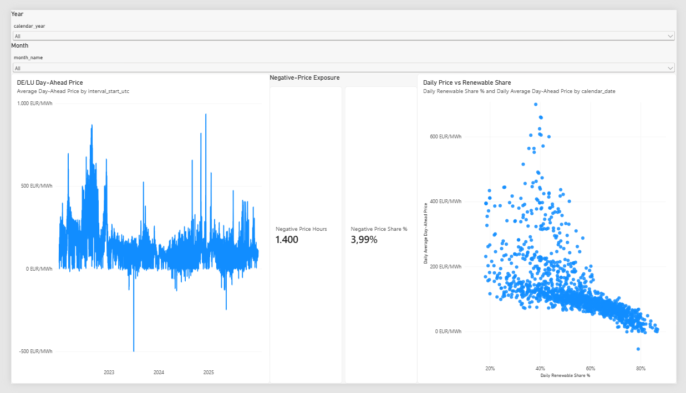
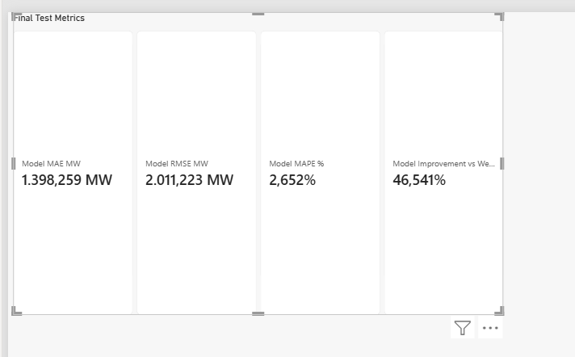
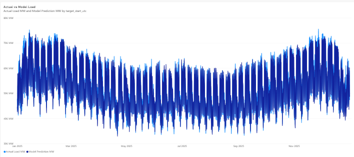
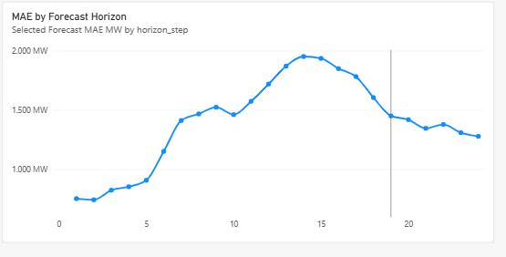
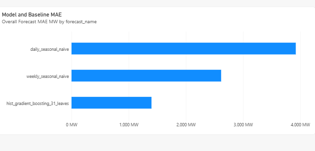
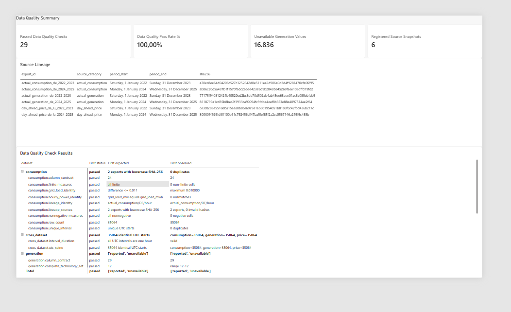

# Power BI report

## Outcome

The Power BI Desktop project implements the frozen semantic contract as a
five-page portfolio report. Its checked-in PBIP/PBIR/TMDL sources contain 15
Import-mode tables, 12 active one-to-many single-direction relationships, one
declared date table, 30 explicit DAX measures, and 21 visuals.

Open `powerbi/GridSight.pbip` in Power BI Desktop to inspect or refresh the
report. Six fact tables refresh from the parameterized local PostgreSQL
reporting views. `Data Quality Checks` and `Source Lineage` read their compact
checked CSVs through the `ProjectRoot` parameter. The repository commits no
Power BI data cache: database-free review is provided by the report sources,
screenshots, semantic contract, and DAX catalogue.

## Executive overview

Across 2022-2025, total grid load was 1,871.998 TWh and renewable generation
represented 54.61% of reported generation. The all-period average DE/LU
day-ahead price was 124.58 EUR/MWh. These are descriptive portfolio KPIs, not
operational forecasts or causal claims.

## Load and renewables

The report preserves hourly seasonality, weekday/weekend load-shape differences,
technology-level generation, and unavailable source values. UTC remains the
unique event time; Europe/Berlin attributes support readable local reporting.

## Price analysis

The price page retains legitimate negative values: 1,400 hours, or 3.99% of
the 35,064 observed hours. The renewable-share scatterplot shows association
only and must not be interpreted as a controlled causal estimate.

## Forecast performance

The frozen histogram-gradient-boosting model achieved 1,398.259 MW test MAE,
2,011.223 MW RMSE, and 2.652% MAPE on the untouched 2025 test. Its MAE was
46.541% lower than the weekly seasonal-naive baseline. This is one historical
test, not evidence of production performance, and the result was not used for
further model selection.

## Data quality and lineage

All 29 published validation checks passed. The report also exposes six source
snapshots, SHA-256 lineage, and 16,836 unavailable generation values rather than
silently converting source markers to measured zero.

## Reconciliation

The report was checked against the acceptance values in
`docs/power-bi-semantic-model.md`. The focused Power BI contract suite passed
all five tests after the Desktop project was saved and source-controlled.
